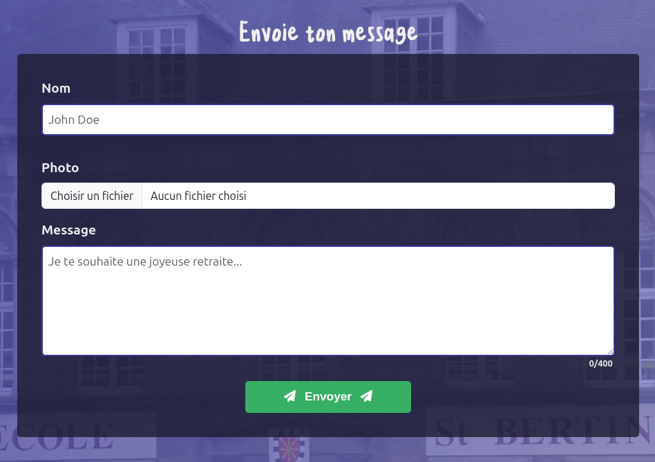

<a name="readme-top"></a>

[![Contributors][contributors-shield]][contributors-url]
[![Forks][forks-shield]][forks-url]
[![Stargazers][stars-shield]][stars-url]
[![Issues][issues-shield]][issues-url]
[![MIT License][license-shield]][license-url]
[![LinkedIn][linkedin-shield]][linkedin-url]


<!-- PROJECT LOGO -->
<br />
<div align="center">
  <a href="https://github.com/othneildrew/Best-README-Template">
    
  </a>

  <h3 align="center">Live Message</h3>

  <p align="center">
    Une solution d'envoie de message en direct pour diffusion sur un écran par exemple
<br />


<a href="https://github.com/Florent-V/Live_Message/issues/new?labels=bug&template=bug-report---.md">Report Bug</a>
·
<a href="https://github.com/Florent-V/Live_Message/issues/new?labels=enhancement&template=feature-request---.md">Request Feature</a>
  </p>
</div>

## Table of Content
- [Table of Content](#table-of-content)
- [A propos du projet](#a-propos-du-projet)
  - [Built With](#built-with)
- [Getting Started](#getting-started)
  - [Prerequisites](#prerequisites)
  - [Installation](#installation)
- [Usage](#usage)
- [Roadmap](#roadmap)
- [Contributing](#contributing)
- [License](#license)
- [Contact](#contact)
- [Acknowledgments](#acknowledgments)


<!-- ABOUT THE PROJECT -->
## A propos du projet



<br/>
<br/>

Le but de ce projet est de diffuser des messages, envoyés par des invités à un événement, sur un écran.  
Les invités peuvent envoyer des messages via un formulaire web, et ces messages sont affichés en direct sur un écran via
une url spécifique, uniquement accessible par les organisateurs de l'événement.  
L'application prend en charge l'envoie d'image et de texte, et les messages sont affichés en temps réel.  
L'application est conçue pour être utilisée sur un écran de télévision ou un projecteur, et est optimisée pour être affichée en plein écran.

Cette application a été conçue pour un départ en retraite. Le but étant que les invités puissent envoyer des messages
tout au long de la soirée, et que ces messages soient affichés en direct sur un écran.


<p style="text-align:right">(<a href="#readme-top">back to top</a>)</p>


### Built With


* [![PHP][PHP.com]][PHP-url]
* [![Symfony][Symfony.com]][Symfony-url]
* [![Javascript][Javascript.com]][Javascript-url]
* [![Bootstrap][Bootstrap.com]][Bootstrap-url]
* [![Mysql][Mysql.com]][Mysql-url]

<p style="text-align:right">(<a href="#readme-top">back to top</a>)</p>

<!-- GETTING STARTED -->
## Getting Started

### Prerequisites

Le projet nécessite :
* PHP 8.2
* Composer
* Symfony 7.0
* MySQL 8

### Installation

1. Cloner le repo
   ```sh
   git clone https://github.com/Florent-V/Live_Message.git
   ```
2. Installer les dépendances
   ```sh
   composer install
   ```
3. Créer un fichier `.env.local` à la racine du projet  
et compléter au minimum les variables suivantes :
   ```env
   DATABASE_URL
   MAILER_DSN
   MAILER_FROM_ADDRESS
   ```
4. Créer la base de données
   ```sh
    php bin/console doctrine:database:create
    php bin/console doctrine:migrations:migrate
    ```
5. Lancer le serveur
   ```sh
    symfony server:start
   ```
6. Chargement des Assets
   ```sh
    php bin/console sass:build --watch
   ```

7. Pour envoyer des messages, il faut se rendre sur l'interface d'envoie de message, accessible via l'url `/message/new`.  

8. Pour accéder à l'interface d'administration il faut d'abord se créer un compte. Pour cela il faut ajouter votre adresse mail aux mails autorisés à l'aide de la commande suivante à lancer dans votre invite de commande mysql :
    ```sql
    INSERT INTO granted_mail (mail) VALUES ('nouvelle_adresse_email@example.com');
    ```
9.  Ensuite il faut s'inscrire via l'url `/register` et valider son compte via le mail de confirmation reçu.  
10. Une fois le compte validé, il est possible de se connecter via l'url `/login` et d'accéder à l'interface d'administration via l'url `/admin/message`  

11. L'adresse de diffusion des messages est accessible via l'url `/admin/message/run`.
    

<p style="text-align:right">(<a href="#readme-top">back to top</a>)</p>


<!-- USAGE EXAMPLES -->
## Usage

Use this space to show useful examples of how a project can be used. Additional screenshots, code examples and demos work well in this space. You may also link to more resources.

_For more examples, please refer to the [Documentation](https://example.com)_

<p style="text-align:right">(<a href="#readme-top">back to top</a>)</p>


<!-- ROADMAP -->
## Roadmap

- [x] Add Changelog
- [x] Add back to top links
- [ ] Add Additional Templates w/ Examples
- [ ] Add "components" document to easily copy & paste sections of the readme
- [ ] Multi-language Support
    - [ ] Chinese
    - [ ] Spanish

See the [open issues](https://github.com/othneildrew/Best-README-Template/issues) for a full list of proposed features (and known issues).

<p style="text-align:right">(<a href="#readme-top">back to top</a>)</p>


<!-- CONTRIBUTING -->
## Contributing

Contributions are what make the open source community such an amazing place to learn, inspire, and create. Any contributions you make are **greatly appreciated**.

If you have a suggestion that would make this better, please fork the repo and create a pull request. You can also simply open an issue with the tag "enhancement".
Don't forget to give the project a star! Thanks again!

1. Fork the Project
2. Create your Feature Branch (`git checkout -b feature/AmazingFeature`)
3. Commit your Changes (`git commit -m 'Add some AmazingFeature'`)
4. Push to the Branch (`git push origin feature/AmazingFeature`)
5. Open a Pull Request

<p style="text-align:right">(<a href="#readme-top">back to top</a>)</p>


<!-- LICENSE -->
## License

Distributed under the MIT License. See `LICENSE.txt` for more information.

<p style="text-align:right">(<a href="#readme-top">back to top</a>)</p>


<!-- CONTACT -->
## Contact

* [![X][X.com]][X-url]
* [![LinkedIn][linkedin-shield]][linkedin-shield]

<p style="text-align:right">(<a href="#readme-top">back to top</a>)</p>


<!-- ACKNOWLEDGMENTS -->
## Acknowledgments

Use this space to list resources you find helpful and would like to give credit to. I've included a few of my favorites to kick things off!

* [Choose an Open Source License](https://choosealicense.com)
* [GitHub Emoji Cheat Sheet](https://www.webpagefx.com/tools/emoji-cheat-sheet)
* [Malven's Flexbox Cheatsheet](https://flexbox.malven.co/)
* [Malven's Grid Cheatsheet](https://grid.malven.co/)
* [Img Shields](https://shields.io)
* [GitHub Pages](https://pages.github.com)
* [Font Awesome](https://fontawesome.com)
* [React Icons](https://react-icons.github.io/react-icons/search)

<p style="text-align:right">(<a href="#readme-top">back to top</a>)</p>


<!-- MARKDOWN LINKS & IMAGES -->
<!-- https://www.markdownguide.org/basic-syntax/#reference-style-links -->

[contributors-shield]: https://img.shields.io/github/contributors/Florent-V/Live_Message.svg?style=for-the-badge
[contributors-url]: https://github.com/Florent-V/Live_Message/graphs/contributors

[forks-shield]: https://img.shields.io/github/forks/Florent-V/Live_Message.svg?style=for-the-badge
[forks-url]: https://github.com/Florent-V/Live_Message/network/members

[stars-shield]: https://img.shields.io/github/stars/Florent-V/Live_Message.svg?style=for-the-badge
[stars-url]: https://github.com/Florent-V/Live_Message/stargazers

[issues-shield]: https://img.shields.io/github/issues/Florent-V/Live_Message.svg?style=for-the-badge
[issues-url]: https://github.com/Florent-V/Live_Message/issues

[license-shield]: https://img.shields.io/github/license/Florent-V/Live_Message.svg?style=for-the-badge
[license-url]: https://github.com/Florent-V/Live_Message/blob/main/LICENSE.txt

[linkedin-shield]: https://img.shields.io/badge/-LinkedIn-black.svg?style=for-the-badge&logo=linkedin&colorB=555
[linkedin-url]: https://www.linkedin.com/in/florentvasseur/


[Next.js]: https://img.shields.io/badge/next.js-000000?style=for-the-badge&logo=nextdotjs&logoColor=white
[Next-url]: https://nextjs.org/

[React.js]: https://img.shields.io/badge/React-20232A?style=for-the-badge&logo=react&logoColor=61DAFB
[React-url]: https://reactjs.org/

[Vue.js]: https://img.shields.io/badge/Vue.js-35495E?style=for-the-badge&logo=vuedotjs&logoColor=4FC08D
[Vue-url]: https://vuejs.org/

[Angular.io]: https://img.shields.io/badge/Angular-DD0031?style=for-the-badge&logo=angular&logoColor=white
[Angular-url]: https://angular.io/

[Svelte.dev]: https://img.shields.io/badge/Svelte-4A4A55?style=for-the-badge&logo=svelte&logoColor=FF3E00
[Svelte-url]: https://svelte.dev/

[Symfony.com]: https://img.shields.io/badge/symfony-%23000000.svg?style=for-the-badge&logo=symfony&logoColor=white
[Symfony-url]: https://symfony.com

[Bootstrap.com]: https://img.shields.io/badge/Bootstrap-563D7C?style=for-the-badge&logo=bootstrap&logoColor=white
[Bootstrap-url]: https://getbootstrap.com

[Javascript.com]: https://img.shields.io/badge/javascript-%23323330.svg?style=for-the-badge&logo=javascript&logoColor=%23F7DF1E
[Javascript-url]: https://javascript.com 

[Mysql.com]: https://img.shields.io/badge/mysql-4479A1.svg?style=for-the-badge&logo=mysql&logoColor=white
[Mysql-url]: https://mysql.com

[PHP.com]: https://img.shields.io/badge/php-%23777BB4.svg?style=for-the-badge&logo=php&logoColor=white
[PHP-url]: https://mysql.com 

[X.com]: https://img.shields.io/badge/X-000000?style=for-the-badge&logo=x&logoColor=white
[X-url]: https://x.com 